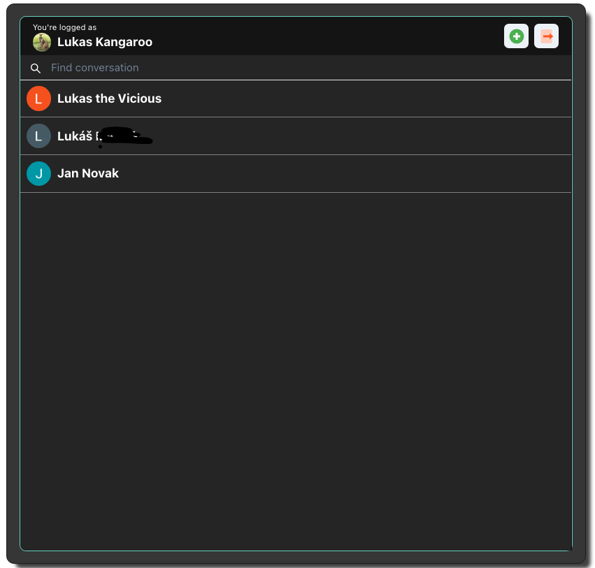

# 📭 Chat App

Chat application using websockets for iteractive communication

## 🔸 Main technologies used

- <b>Frontend:</b>
  [React](https://reactjs.org/), [Typescript](https://www.typescriptlang.org/)
- <b>Backend:</b>
  [Node.js](https://nodejs.org/en/), [Express](https://expressjs.com/), [Socket.io](https://socket.io/)
- <b>Database:</b>
  [PostgreSQL](https://www.postgresql.org/)
- <b>Other:</b>
  [styled-components](https://styled-components.com/), [Chakra UI](https://chakra-ui.com/)

## 🔸 Screenshots





## 🔸 Key Features

User is able to:

- login
- search users and add conversations
- filter conversations
- chat with users, who have been added to conversations

## 🔸 Configuration and setup

In order to run this project locally, simply fork and clone the repository or download as zip and unzip on your machine.

- Open the project in your prefered code editor.
- Go to terminal -> New terminal (If you are using VS code)

#### 1. Client

```
$ cd client
```

Create .env file in the root of your directory and add following variables, based on your Firebase project setup:

```
REACT_APP_FIREBASE_API_KEY
REACT_APP_FIREBASE_AUTH_DOMAIN
REACT_APP_FIREBASE_PROJECT_ID
REACT_APP_FIREBASE_STORAGE_BUCKET
REACT_APP_FIREBASE_MESSAGING_SENDER_ID
REACT_APP_FIREBASE_APP_ID
```

```
$ npm install (to install client-side dependencies)
& npm start (to start the client)
```

#### 2. Server

```
$ cd server
```

Create .env file in the root of your directory and add following variables, based on your PostgreSQL database setup:

```
POSTGRES_USER
POSTGRES_PASSWORD
POSTGRES_HOST
POSTGRES_DB
```

```
$ npm install (to install server-side dependencies)
& nodemon index.js (to start the server)
```

Create your PostgreSQL database based on schema in following file:

```
server/database.sql
```
